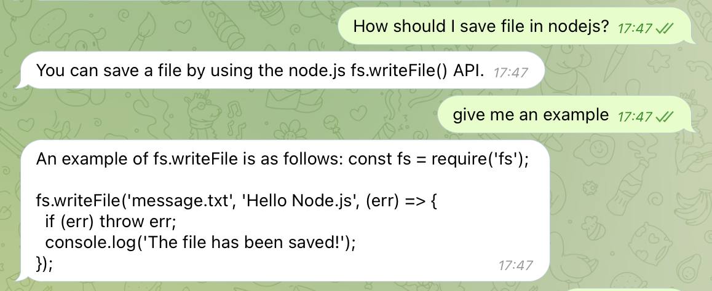

# Descirption
Telegram bot to chat with OpenAI's chatgpt which supports conversation context and speech to text to respond to voice messages.

# Setup
1. Use `.env.sample` file to define your environment variables.

| Varuable      | Description |
| ----------- | ----------- |
| TELEGRAM_PROD_ACCESS_KEY      | The production stage telegram bot token       |
| TELEGRAM_SANDBOX_ACCESS_KEY   | The sandbox stage telegram bot token        |
| OPENAI_API_KEY | OpenAI secret key
| PICOVOICE_ACCESS_KEY | Picovoice speech to text access key

> You can ignore `PICOVOICE_ACCESS_KEY` if you don't want to process voice messages in telegram.

2. Use PM2 to start the service. 

# Chat context support
The best way to keep the gpt be aware of the history of the chat (giving them the context of conversation) is to create prompts including the prevoius question with the output of gpt. I have followed the same approach, however due to the high fee rates, I only included the last message and response. This should be modifiable in future.